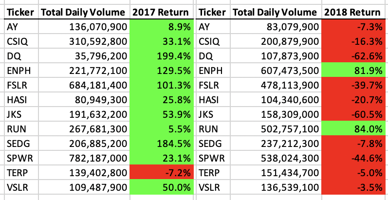
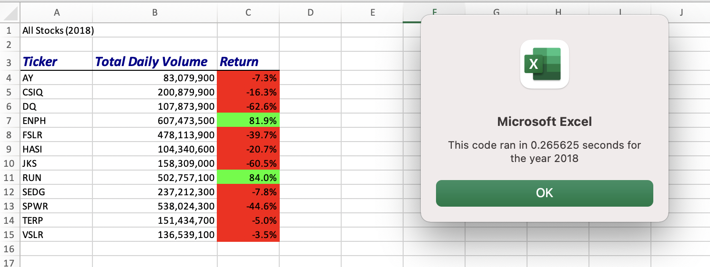

# VBA_Challenege
Module 2 - VBA 

## Overview of Project 
Steve is a recent finance graduate, and his parents want to be his first clients. Steve came to us for help analyzing a data set of stocks over two years. Throughout this module, we analyzed the stocks for Steve to present to his parents. In this challenege, our main goal was to refactor, or edit, the code we created in the module to be more efficent. Our final result was a user-friendly excel workbook for 2017 and 2018 for Steve to present to his parents to help them make an informed decision for their investment. 

## Results 
We found that there were only two stocks that remained profitable in 2017 and 2018. Those stocks were ENPH and RUN. Unfortunately for Steve's parents, DQ only generated a positive return in 2017. Steve should recommend ENPH and RUN to his parents, they had a significant increases from 2017 to 2018, and they continued to have positive returns throughout 2018. 

### Refactoring Results 

Before the refactoring of the code from this module, the code ran at approximately .2 seconds. 

After refactoring the code from this module, the code ran in approximately .086 seconds. 

## Summary 

### Advantages of refactoring Code 

### Refactoring Original VBA Code 
