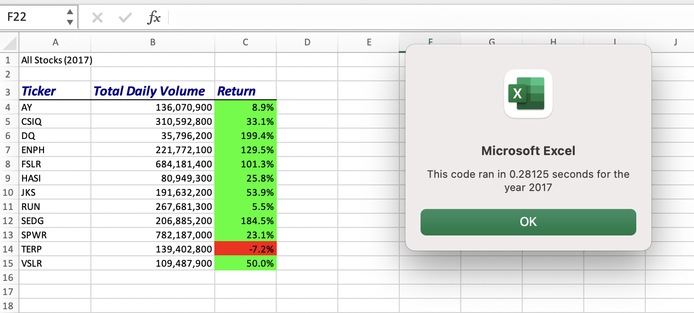

# VBA_Challenege
Module 2 - VBA 

## Overview of Project 
Steve is a recent finance graduate, and his parents want to be his first clients. Steve came to us for help analyzing a data set of stocks over two years. Throughout this module, we analyzed the stocks for Steve to present to his parents. In this challenege, our main goal was to refactor, or edit, the code we created in the module to be more efficent. Our final result was a user-friendly excel workbook for 2017 and 2018 for Steve to present to his parents to help them make an informed decision for their investment. 

## Results 
We found that there were only two stocks that remained profitable in 2017 and 2018. Those stocks were ENPH and RUN. Unfortunately for Steve's parents, DQ only generated a positive return in 2017. Steve should recommend ENPH and RUN to his parents. These stocks had a significant increases from 2017 to 2018, and they continued to have positive returns throughout 2018. 

### Refactoring Results 

Before the refactoring of the code from this module, the code ran at approximately .3 seconds. 

After refactoring the code from this module, the code ran in approximately .086 and .05 seconds. 

### Coding 
The original code contained a nested for loop that outputted the data to the sheet after every iteration. After refactoring the code, the code loops through the data and outputs the needed information or data after combing through all the data. 

## Summary 
In this situation, the code was fairly easy to refactor because I was already familair with the code. Refactoring the code made the code run faster, therefore be more efficent. 

### Advantages of refactoring Code 
Refactoring code is very important for programmers to know. When writing and working through a difficult code, you may not be thinking of how to make the code run efficently. When refactoring the code, you are making the code more efficent by using less memory or taking fewer steps to achieve the same goal. 

### Disadvantages of refactoring code 
When refactoring code, you could possibly create bugs in the code that prevent the code from running. A programmer may also have difficulties refactoring code if they are working on code that was created by someone else. 

### Refactoring Original VBA Code 
A benefit for the refactored code in this challenge is the faster run time, therefore making the code more efficent. When working with larger data sets, refactoring code would save even more time than we experienced in this challenge. 

A disadvantage of refactoring this code was the new bugs added from mistypes and the amount of time it took to refactor compared to the very small change it made to the run time. 
